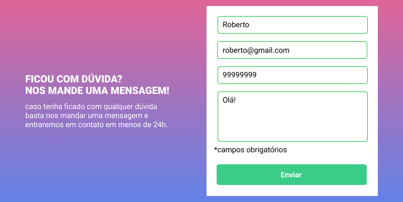

# Formulário com Validação ✔ ❌

Quest de JS Intermediário do curso [DevQuest](https://devemdobro.com), onde tinha como foco o devenvolvimento do [Figma](https://www.figma.com/file/zBKnYG9UNdUiIr8ClQTWSG/DESAFIO---HTML%2FCSS%2FJS-INTERMEDIÁRIO?type=design&node-id=3-2&mode=design&t=BhLK0ne5IDKQx4HZ-0)

<div style="display: block; text-align: center;">
    
    
    
</div>

## Minha Resolução 💡


**[Clique aqui](https://amandameneghini.github.io/formulario-com-autenticacao/) para visualizar**

### Tecnologias Utilizadas 🛠

<div style="display: flex;">
    
    
    
</div>

### Ferramenta Utilizada na Responsividade 💻📱 


<br>

**Extenção** do Google Chrome "[Responsive Viewer](https://chromewebstore.google.com/detail/responsive-viewer/inmopeiepgfljkpkidclfgbgbmfcennb)" 

## Como utiliza 🤔

1. Crie uma pasta em que deseja clonar o repositório.

2. Com o botão dirteito do mouse selecione a opção "Git Bash HERE"

3. Clone o projeto (no prompt do Git Bash):

```
git clone https://github.com/AmandaMeneghini/formulario-com-autenticacao.git
```

4. Acesse a pasta do projeto:

```
cd formulario-com-autenticacao
```

5. Abra o código no VS Code:

```
code .
```

Passos extras com a extensão **Live Server** no **VS Code**:

6. Vá no VS Code em extenções e baixe a extenção "Live Server"

7. Aperte **Alt + L + O**, para a visualização do projeto